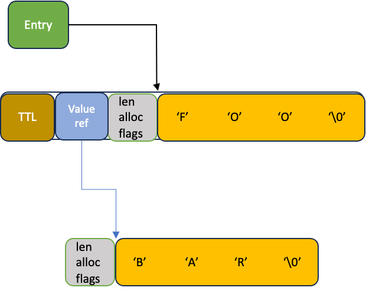

# Hash Items TTL Support in Valkey RFC


## Abstract

The open-source Valkey community, recognized the growing need for fine-grained control over hash object metadata by introducing Hash Field Expiration (HFE), a feature that allows setting time-to-live (TTL) for individual fields within hash objects. Driven by customer requests for more precise data management and inspired by Redis Ltd.'s recent introduction, We introduce an approach focusing on memory efficiency and performance while maintaining existing user experiences. The solution involves implementing two expiration mechanisms: lazy expiration, which releases items when accessed, and a background cron job that scans and expires volatile items. By developing an efficient active expiry mechanism, we aim to reduce cron cycle times and minimize tail latency, ultimately providing developers with granular control over data lifecycle management. The implementation also prioritizes API compatibility with existing Redis clients, enabling seamless migration and adoption for users seeking more sophisticated hash object management capabilities. 

## Motivation

Introducing field-level expiration for data structures like hashes and sets in Valkey would significantly enhance its flexibility and applicability in modern application architectures. Many use cases—such as session management, per-user rate limits, temporary access rights, feature store toggles, and short-lived membership in groups—require storing multiple items within a single Valkey key, where each item has its own independent expiration time. Currently, Valkey supports expiration only at the key level, which forces developers to either fragment data across multiple keys or implement complex application-side logic to simulate item-level TTLs. This increases operational overhead, complicates data access patterns, and undermines the simplicity Valkey is known for. Native support for field or member expiration within hashes and sets would streamline data modeling, reduce maintenance burdens, and enable more efficient memory usage and access control in real-time systems.

Sub-Items expiration was introduced in several Redis-compatible forks including [Keydb](https://docs.keydb.dev/blog/2019/10/21/blog-post/), [Dragonfly](https://www.dragonflydb.io/docs/command-reference/hashes/hsetex), [Redis](https://redis.io/blog/hash-field-expiration-architecture-and-benchmarks/) and [TairHash module ](https://github.com/tair-opensource/TairHash).
In order to unblock workloads which are utilizing this logic we would like valkey to offer a similar ability.

## Design considerations 

### Requirements

* Support Redis compatible API to set, get and manipulate Hash field TTL.
* Support both Lazy and active expiry mechanisms for Hash field expirations.
* Support Replication of elements TTL as well as expired element replication.
* Extended support for the same functionality with Sets and Sorted sets.

### Tenets

* **memory efficiency** - At the highest priority we target a minimal metadata overhead used in order to store and manage items TTL. While the optimal overhead to maintain item TTL is 8 bytes (could be less if we allow keeping offsets from the existing epoch diff time), we understand that maintaining active expiry logic will require use of more bytes for metadata. We will make our top priority effort to minimize this overhead.
* **Latency** - After memory efficiency considerations we will require a solution which provides low latency for hash operations. Hash objects are expected to operate in O(1) for all single access operations (get, set, delete etc...) and we will not break this promise even for items with expiry.
* **CPU efficiency** - After latency we priorities system CPU efficiency. For example we would like to avoid high CPU utilization caused by need to perform null active expiry checks during cron runs.
* **Compatability** - We will avoid breaking clients which are already using HFE API provided by other providers.
* **Coherency** -  We would like the reported system state to match the logical state as much as possible. For example the reported number of keys per DB is expected to match the number of keys which are NOT logically expired.  

# Specification

## Commands

The proposed API is very much identical to the Redis provided API (Redis 7.4 + 8.0). This is intentionally proposed in order to avoid breaking client applications already opted to use hash items TTL.

#### HSETEX

**Synopsis**

```
HSETEX key [FNX | FXX] [EX seconds | PX milliseconds |
  EXAT unix-time-seconds | PXAT unix-time-milliseconds | KEEPTTL]
  FIELDS numfields field value [field value ...]
```

Set the value of one or more fields of a given hash key, and optionally set their expiration time or time-to-live (TTL).

The HSETEX command supports the following set of options:

* `FNX` — Only set the fields if none of them already exist.
* `FXX` — Only set the fields if all of them already exist.
* `EX seconds` — Set the specified expiration time in seconds.
* `PX milliseconds` — Set the specified expiration time in milliseconds.
* `EXAT unix-time-seconds` — Set the specified Unix time in seconds at which the fields will expire.
* `PXAT unix-time-milliseconds` — Set the specified Unix time in milliseconds at which the fields will expire.
* `KEEPTTL` — Retain the TTL associated with the fields.

The `EX`, `PX`, `EXAT`, `PXAT`, and `KEEPTTL` options are mutually exclusive.


#### HEGTEX 

**Synopsis**

```
HGETEX key [EX seconds | PX milliseconds | EXAT unix-time-seconds |
  PXAT unix-time-milliseconds | PERSIST] FIELDS numfields field
  [field ...]
```

Get the value of one or more fields of a given hash key and optionally set their expiration time or time-to-live (TTL).

The `HGETEX` command supports a set of options:

* `EX seconds` — Set the specified expiration time, in seconds.
* `PX milliseconds` — Set the specified expiration time, in milliseconds.
* `EXAT unix-time-seconds` — Set the specified Unix time at which the fields will expire, in seconds.
* `PXAT unix-time-milliseconds` — Set the specified Unix time at which the fields will expire, in milliseconds.
* `PERSIST` — Remove the TTL associated with the fields.

The `EX`, `PX`, `EXAT`, `PXAT`, and `PERSIST` options are mutually exclusive.

#### HEXPIRE 

**Synopsis** 

```
HEXPIRE key seconds [NX | XX | GT | LT] FIELDS numfields
  field [field ...]
```

Set an expiration (TTL or time to live) on one or more fields of a given hash key. You must specify at least one field. Field(s) will automatically be deleted from the hash key when their TTLs expire.
Field expirations will only be cleared by commands that delete or overwrite the contents of the hash fields, including [`HDEL`](https://redis.io/docs/latest/commands/hdel/) and [`HSET`](https://redis.io/docs/latest/commands/hset/) commands. This means that all the operations that conceptually *alter* the value stored at a hash key's field without replacing it with a new one will leave the TTL untouched.
You can clear the TTL of a specific field by specifying 0 for the ‘seconds’ argument.
Note that calling `HEXPIRE`/[`HPEXPIRE`](https://redis.io/docs/latest/commands/hpexpire/) with a time in the past will result in the hash field being deleted immediately.

The `HEXPIRE` command supports a set of options:

* `NX` — For each specified field, set expiration only when the field has no expiration.
* `XX` — For each specified field, set expiration only when the field has an existing expiration.
* `GT` — For each specified field, set expiration only when the new expiration is greater than current one.
* `LT` — For each specified field, set expiration only when the new expiration is less than current one.

#### HEXPIREAT

**Synopsis**

```
HEXPIREAT key unix-time-seconds [NX | XX | GT | LT] FIELDS numfields
  field [field ...]
```

`HEXPIREAT` has the same effect and semantics as `HEXPIRE`, but instead of specifying the number of seconds for the TTL (time to live), it takes an absolute Unix timestamp in seconds since Unix epoch. A timestamp in the past will delete the field immediately.

The `HEXPIREAT` command supports a set of options:

* `NX` — For each specified field, set expiration only when the field has no expiration.
* `XX` — For each specified field, set expiration only when the field has an existing expiration.
* `GT` — For each specified field, set expiration only when the new expiration is greater than current one.
* `LT` — For each specified field, set expiration only when the new expiration is less than current one.

#### HPEXPIRE

**Synopsis**

```
HPEXPIRE key milliseconds [NX | XX | GT | LT] FIELDS numfields
  field [field ...]
```

This command works like `HEXPIRE`, but the expiration of a field is specified in milliseconds instead of seconds.

The `HPEXPIRE` command supports a set of options:

* `NX` — For each specified field, set expiration only when the field has no expiration.
* `XX` — For each specified field, set expiration only when the field has an existing expiration.
* `GT` — For each specified field, set expiration only when the new expiration is greater than current one.
* `LT` — For each specified field, set expiration only when the new expiration is less than current one.

#### HPEXPIREAT

**Synopsis** 

```
HPEXPIREAT key unix-time-milliseconds [NX | XX | GT | LT]
  FIELDS numfields field [field ...]
```

`HPEXPIREAT` has the same effect and semantics as `HEXPIREAT``,` but the Unix time at which the field will expire is specified in milliseconds since Unix epoch instead of seconds.

#### HPERSIST

**Synopsis** 

```
HPERSIST key FIELDS numfields field [field ...]
```

Remove the existing expiration on a hash key's field(s), turning the field(s) from *volatile* (a field with expiration set) to *persistent* (a field that will never expire as no TTL (time to live) is associated).

#### HSETEX

**Synopsis**

```
HSETEX key [NX] seconds field value [field value ...]
```

Similar to `HSET` but adds one or more hash fields that expire after specified number of seconds. By default, this command overwrites the values and expirations of specified fields that exist in the hash. If `NX` option is specified, the field data will not be overwritten. If `key` doesn't exist, a new Hash key is created.

The HSETEX command supports a set of options:

* `NX` — For each specified field, set expiration only when the field has no expiration.

#### HTTL

**Synopsis**

```
HTTL key FIELDS numfields field [field ...]
```

Returns the **remaining** TTL (time to live) of a hash key's field(s) that have a set expiration. This introspection capability allows you to check how many seconds a given hash field will continue to be part of the hash key.

#### HPTTL

```
HPTTL key FIELDS numfields field [field ...]
```

Like [`HTTL`](https://redis.io/docs/latest/commands/httl/), this command returns the remaining TTL (time to live) of a field that has an expiration set, but in milliseconds instead of seconds.

#### HEXPIRETIME

**Synopsis**

```
HEXPIRETIME key FIELDS numfields field [field ...]
```

Returns the absolute Unix timestamp in seconds since Unix epoch at which the given key's field(s) will expire.

#### HPEXPIRETIME

**Synopsis**

```
HPEXPIRETIME key FIELDS numfields field [field ...]
```

`HPEXPIRETIME` has the same semantics as `HEXPIRETIME`, but returns the absolute Unix expiration timestamp in milliseconds since Unix epoch instead of seconds.


## Keyspace-notification requirements

* A new `hexpire` event will be issued whenever a key field is being assigned with an expiry. This will include both cases of assigning TTL for element which had NO prior TTL assigned and when a TTL is changed on an item which already had TTL assigned. 
    The same `hexpire` event will be issued for all different commands which manipulate item TTL (e.g.  `HEXPIRE`, `HEXPIREAT`, `HPEXPIRE` etc...)
    NOTE that for some cases (e.g HSETEX, there will be 2 events issued: `HSET` and `HEXPIRE`)
* A new `hpersist` event will be issued whenever an item is persisted. this can be when `HPERSIST` was issued.
* A new `hexpired` event will be issued whenever an item is actually being expired (either actively or lazily) 
    NOTE 1 - for the initial implementation the plan is to emit `hexpired` event for each field expiry, however it might be a valid future performance optimization to batch multiple expirations on the same key into a single event reporting.  
    NOTE 2 - That in case the `HEXPIRE` or any of its variants where used with '0' TTL (which results in the item being deleted) there should also be at least 2 events issued:  ``hexpire`` and `hexpired` (per each of the expired elements)

## Append-only file

In order to implement the item expirations with AOF rewrite, we will separate the set of the items
from the set of the expiration.
Example:

```
int rewriteHashObject(rio *r, robj *key, robj *o) {
    hashTypeIterator hi;
    long long count = 0, volatile_items = hashTypeNumVolatileElements(o), items = hashTypeLength(o) - volatile_items;

    hashTypeInitIterator(o, &hi);
    while (hashTypeNext(&hi) != C_ERR) {
        if (count == 0) {
            int cmd_items = (items > AOF_REWRITE_ITEMS_PER_CMD) ? AOF_REWRITE_ITEMS_PER_CMD : items;

            if (!rioWriteBulkCount(r, '*', 2 + cmd_items * 2) || !rioWriteBulkString(r, "HMSET", 5) ||
                !rioWriteBulkObject(r, key)) {
                hashTypeResetIterator(&hi);
                return 0;
            }
        }

        if (volatile_items > 0 && hashTypeEntryHasExpire(hi.next))
            continue;

        if (!rioWriteHashIteratorCursor(r, &hi, OBJ_HASH_FIELD) || !rioWriteHashIteratorCursor(r, &hi, OBJ_HASH_VALUE)) {
            hashTypeResetIterator(&hi);
            return 0;
        }
        if (++count == AOF_REWRITE_ITEMS_PER_CMD) count = 0;
        items--;
    }

    hashTypeResetIterator(&hi);

    /* Now serialize volatile items if exist */
    if (hashTypeHasVolatileElements(o)) {
        hashTypeInitVolatileIterator(o, &hi);
        while (hashTypeNext(&hi) != C_ERR) {
            long long expiry = hashTypeEntryGetExpiry(hi.next);
            sds field = hashTypeEntryGetField(hi.next);
            sds value = hashTypeEntryGetValue(hi.next);
            if (rioWriteBulkCount(r, '*', 8) == 0) return 0;
            if (rioWriteBulkString(r, "HSETEX", 6) == 0) return 0;
            if (rioWriteBulkObject(r, key) == 0) return 0;
            if (rioWriteBulkString(r, "PXAT", 4) == 0) return 0;
            if (rioWriteBulkLongLong(r, expiry) == 0) return 0;
            if (rioWriteBulkString(r, "FIELDS", 6) == 0) return 0;
            if (rioWriteBulkLongLong(r, 1) == 0) return 0;
            if (rioWriteBulkString(r, field, sdslen(field)) == 0) return 0;
            if (rioWriteBulkString(r, value, sdslen(value)) == 0) return 0;
        }
        hashTypeResetIterator(&hi);
    }
    return 1;
}
```

this has some drawbacks:
1. We have no way to iterate over non-volatile items. In case of high number of volatile items, we will still iterate over all of the items in the hash.
2. We will not bulk items with the same expiration time. Although this optimization can be applied, it might be complicated in case we have no way to identify
if items have the exact same expiration. 

## RDB

### Saving items expirations

1. We will use a dedicated hash object type ie `RDB_TYPE_HASH_2`. 
the hashObject type will be deducted by the fact that the hashtable includes any items with expiry
by checking the condition `hashTypeHasVolatileElements` e.g.:

```
case OBJ_HASH:
    if (o->encoding == OBJ_ENCODING_LISTPACK)
        return rdbSaveType(rdb, RDB_TYPE_HASH_LISTPACK);
    else if (o->encoding == OBJ_ENCODING_HASHTABLE)
        if (hashTypeHasVolatileElements(o))
            return rdbSaveType(rdb, RDB_TYPE_HASH_2); <-- new logic
        else
            return rdbSaveType(rdb, RDB_TYPE_HASH);
```

The main reason to maintain forward compatibility in rollback cases. 
This has some drawbacks. First, future changes to the HASH serialization might have to split into 2 cases. 
Second, We will dd expiry for ANY item even in case it has NO expiry but only in the cases were 
the Hash object contains volatile entries.

Example:

```
int add_expiry = hashTypeHasVolatileElements(o); <--- check here
hashTypeSetAccessContextWithFlags(o, FIELD_ACCESS_NOEXPIRE | FIELD_ACCESS_IGNORE_TTL);

hashtableIterator iter;
hashtableInitIterator(&iter, ht, 0);
void *next;
while (hashtableNext(&iter, &next)) {
    sds field = hashTypeEntryGetField(next);
    sds value = hashTypeEntryGetValue(next);

    if ((n = rdbSaveRawString(rdb, (unsigned char *)field, sdslen(field))) == -1) {
        hashtableResetIterator(&iter);
        return -1;
    }
    nwritten += n;
    if ((n = rdbSaveRawString(rdb, (unsigned char *)value, sdslen(value))) == -1) {
        hashtableResetIterator(&iter);
        return -1;
    }
    nwritten += n;
    if (add_expiry) {
        long long expiry = hashTypeEntryGetExpiry(next);
        if ((n = rdbSaveMillisecondTime(rdb, expiry) == -1)) { <--- apply here
            hashtableResetIterator(&iter);
            return -1;
        }
        serverLog(LL_NOTICE, "save key %s with expiry: %lld", field, expiry);
        nwritten += n;
    }
}
```

2. Will also save items which are actually expired by TTL. This is in order to keep replication logic correct, as it is possible
   that some item already has pending HDEL driven by expiration in the backlog.


### Loading items with expirations

1. in case the Object type is `RDB_TYPE_HASH_2` we will immidiately convert it to hashtable representation:

```
o = createHashObject();

        /* Too many entries or hash object contains elements with expiry? Use a hash table right from the start. */
        if (len > server.hash_max_listpack_entries || rdbtype == RDB_TYPE_HASH_2)
            hashTypeConvert(o, OBJ_ENCODING_HASHTABLE);
```

2. After identify the type we will also parse the item TTL:

```
/* Load remaining fields and values into the hash table */
while (o->encoding == OBJ_ENCODING_HASHTABLE && len > 0) {
    len--;
    /* Load encoded strings */
    if ((field = rdbGenericLoadStringObject(rdb, RDB_LOAD_SDS, NULL)) == NULL) {
        decrRefCount(o);
        return NULL;
    }
    if ((value = rdbGenericLoadStringObject(rdb, RDB_LOAD_SDS, NULL)) == NULL) {
        sdsfree(field);
        decrRefCount(o);
        return NULL;
    }

    /* Also load the entry expiry */
    long long itemexpiry = -1;
    if (rdbtype == RDB_TYPE_HASH_2) {
        itemexpiry = rdbLoadMillisecondTime(rdb, RDB_VERSION);
        serverLog(LL_NOTICE, "load key %s with expiry: %lld", field, itemexpiry);
        if (itemexpiry == LLONG_MAX && rioGetReadError(rdb)) return NULL;
    }

    /* Add pair to hash table */
    hashTypeEntry *entry = hashTypeCreateEntry(field, value, itemexpiry, NULL, 0);
    sdsfree(field);
    if (!hashtableAdd((hashtable *)o->ptr, entry)) {
        rdbReportCorruptRDB("Duplicate hash fields detected");
        freeHashTypeEntry(entry);
        decrRefCount(o);
        return NULL;
    }

    if (rdbtype == RDB_TYPE_HASH_2 && itemexpiry > 0) {
        hashTypeTrackEntry(o, entry);
    }
}
```

### Alternatives considered

We could apply the change to include a metadta per every hash item entry. This will prevent forward RDB compatability, but might help reduce the extra memory used for RDB
in caseses were most items are not volatile and the metadata size is small (smaller than 8 bytes). 


## Configuration 

We suggest to avoid placing new configuration to fine tune this feature. Internal configurations can be discussed in order to be able to
prevent active expiration of volatile items.

## Benchmarking (TBD)

## Observability (TBD)

## Design Details

### Known design limitations

* As item expiration will produce replication content, in some cases we will avoid applying full expiration logic.
    the following cases will avoid lazy expiring items:
     - during HSCAN, HGETALL, Copy (when duplicating an element) and RDB/EOF loading.
* Since expired items are not immediately expired (when not accessed) it is possible that some commands will return a false state of an Object. For example HLEN will return the number of elements CURRENTLY held in the Hash including items which are expired (and not yet actively expired)
* During Copy of an element we will NOT copy items which are expired. This means that application validating the copy by checking the objects length might fail on validation.     

### Volatile hash entry memory layout

Currently a field is always an SDS in Valkey. Although it is possible to match a key with external metadata (eg TTL) by mapping the key to the relevant metadata, it will incur extra memory utilization to hold the mapping and will require to use extra CPU cycles in order to locate the TTL per each query. Some dictionaries use objects with embedded keys were the metadata can be set as part of the object. However that would require every dictionary which needs TTL support to use objects with embedded  keys and might significantly complicate existing code paths as well as require extra memory in order hold the object metadata.
We propose to embed the Expiry time with each HASH entry.
Hash entries **always** have the field embedded in the entry, while the entry reference is always pointing to the start of the string containing the field name.
Hash entries currently provide 2 layouts:


#### Entry with embedded value

In this case the value is placed directly after the field in the same allocation buffer. this layout is supported when the combined field and value sds memory is less than 128 bytes (2 cache lines): 


#### Entry with reference value

When the combined field and value sds memory size exceeds the 128 bytes limit, the value is referenced from the entry:


### Hash entry with embedded TTL

When embedding the expiry in the hash entry, we aim for fast access to the expiry data. For this reason we suggest to place the expiry time close to the entry reference point in order to make sure the TTL will be available in the same cache line. The need to keep embedded value entries allocated in a 128 bytes allocations will still apply, only the calculation will also include the 8 bytes expiry value. The suggested layout is thus:

**For embedded value entries**


**For referenced value entries**




### Alternatives considered

Another potential solution would be to always place the expiry at the **END** of the entry allocation:


This has the benefit of avoid reallocating EXISTING entries when an expiry is first set or removed (e.g. using HEXPIRE or HPERSIST). The reason no choosing this potential layout is that it might lead to cases of cache misses when accessing expiry data for entries with long field/value.     


#### HASH Object ListPack representation

User can configure hash type objects to use memory efficient representation using listpacks. Although we could add TTL to the listpack representation this might greatly complicate the usage when some items do not have TTL and others does. Using an external data structure to manage the TTL for listpack elements which were assigned TTL is possible but might reduce the memeory efficiency of this representation. In the sake of simplicity we will force listpack conversion to hashtable representation as soon as the first item TTL is set. This way we will not enforce memory efficiency degradation for users not setting TTL on hash object elements.   


### Items expiration context

When expiring an entry, the following actions will take place:

1. Propagate the `HDEL` event to the replication backlog
2. remove the relevant entry from the containing Object (HASH, SET, ZSET etc...)
3. Untrack the entry for active expiration (will be extended later)
4. issue a keyspace notification regarding the item expiry
5. update expiry related statistics

In order to support all these operations there are mandatory inputs which must be provided for each expiration action:

1. The current database - is required in order to propagate the command in the correct database context.
2. The relevant Object - is required for several reasons. 
    **First** since all objects have their key name embedded we can retain the key name in order to propagate the command to the replication backlog. **
    Second** all related item tracking can be accessed and updated from the object itself.

### Lazy expiration

Lazy expiration happen whenever an item which has expired TTL is accessed. In this case the item will be **immediately** removed from the owning object and expired (as described in the expiration context section). This include both read and write commands access context. For items (fields) ‘access’ logic we aim to follow the same logic used for generic keys. 
When accessing an item, there are 3 potential states it can be stated:

1. Not Expired - meaning the item is to be treated as any existing item and be included in replies as well as operated on during actions and mutations.     
2. Expired - meaning the item should be treated as “not exists” and is NOT to be included in any operations and/or replies.
3. Reclaimed - meaning the item is expired and to-be-removed immediately (i.e reclaimed). 

The decision regarding the item “state” is taken when the item is accessed during command processing.

#### Lazy expiration logic

The logic to operate the item state on access: 

1. in case lazy expiry is disabled (currently only performed by modules operating on keyspace-notifications or async delete to avoid endless loops) the item is considered VALID.
2. When server is loading RDB/AOF all items are considered VALID (i.e lazy expiry is disabled during load AOF/RDB).
    This is important in order to ensure correctness of dependent future actions.
3. Replica server handling primary client command from the primary will treat all items as VALID
    NOTE - this will be the same for writable replicas case AND for the case the owning key was accessed with the LOOKUP_NOEXPIRE flag! 
4. Importing source client handling command from the source will treat all items as VALID
    NOTE - this will also be the case when the owning key was accessed with the LOOKUP_NOEXPIRE flag!     
5. Item which is accessed and NOT expired will be treated as VALID
6. Replica server processing regular client command and accessing an expired item will treat that item as INVALID
7. Server processing importing source client command and accessing an expired item will treat that item as INVALID
8. When expiry actions are paused an expired key which is accessed will be treated as INVALID
9. In all other cases, when an expired key is accessed it will be expired and treated as INVALIDATED

### Lazy expiry low level design

In order to apply the lazy expiration logic we have two options:


1. Introduce a new `itemExpireIfNeeded` method which will accept either the key name or item reference (depends on the context) and will apply the item state logic while expiring the element if needed.
    Although in theory this might sound very easy to implement, it would basically require handling and potentially changing many code paths. The reason is that, unlike generic keys, there is no explicit access point to an object item.
    When accessing generic keys we have a set of lookupKey* functions which provides a generic point of access to keys where we can apply the expiration logic. Items, on the other hand are currently accessed in many different paths as part of the implementation of a specific algorithm.  
    For example, random key selection is scanning random hashtable elements which is an algorithm implemented in the hashtable infrastructure. It would be challenging in case we would like to apply the lazy expiration logic on scanned elements.
    
    Pros:
     - Follows the same approach as generic keys are handled
     - Does not require introducing complicated new infrastructure.
    Cons:
     - Error prone - there are many cases where an item is accessed  
     - Might require extensive code changes.
     - In some cases can lead to performance degradation on the good-path - It is possible that in order to avoid code complexity we would consider to apply the `itemExpireIfNeeded` logic by first searching the item (provided in the command arguments) and then proceed with the normal implementation. Since double searching the element would probably maintain cache locality for the second search, in reality we observed 2-3% degradation by applying double search on items in the command processing.
2. Introduce a hashtable infrastructure for accessing keys (Preferred)
    In this approach we suggest to formalize the item access by introducing a new `access` virtual method to the hashtable type, eg:
    

```
   typedef enum {
   ELEMENT_NONE = 0,
   ELEMENT_VALID,
   ELEMENT_INVALID,
   ELEMENT_DELETE,
} hashtableElementAccessState;
  
  typedef struct {
      const void *(*entryGetKey)(const void *entry);
      uint64_t (*hashFunction)(const void *key);
     ...
      unsigned instant_rehashing : 1;
     NEW -> hashtableElementAccessState (accessElement)(hashtable ht, void entry);
 };
```

Since all items are actually referenced from a hashtable, this will  provide a generic way to acentralize all item access for different object types (eg SETS and ZSETS).
The main challenge, in this case, is to propagate the expiration context (ie Owning object and database) during hashtable access.
We propose to include a way to store the current context globally (e.g in TLS), which will require adding set and reset of the context in various command handling places.
For example:

```
typedef struct {
    robj *val;
    int flags;
} access_context;

static __thread access_context ht_access_context = {0};

void hashTypeSetAccessContext(robj *o) {
    ht_access_context.val = o;
    ht_access_context.flags = 0;
}

void hashTypeSetAccessContextWithFlags(robj *o, int flags) {
    ht_access_context.val = o;
    ht_access_context.flags = flags;
}

void hashTypeResetAccessContext(void) {
    ht_access_context.val = NULL;
    ht_access_context.flags = 0;
}

// Example use case:
sds hashTypeGetFromHashTable(robj *o, sds field) {
    serverAssert(o->encoding == OBJ_ENCODING_HASHTABLE);
    void *found_element = NULL;
    hashTypeSetAccessContext(o);
    hashtableFind(o->ptr, field, &found_element);
    hashTypeResetAccessContext();
    if (found_element)
        return hashTypeEntryGetValue(found_element);
    else
        return NULL;
}
```

     In this example, the global context is holding the accessed object reference (the database can be taken from the                   server→current_client). It also holds a flags bitmap in order to have better fine grinned control over the item access (for         example avoiding expiring elements during large scan iterations).

Pros:
     - Minimal code changes.
     - Less error prone - since this will be applied in every hashtable access we will reduce the risk of missing item being                 accessed in some flows. 
Cons:
      - Additional check for `accessElement` existence in the generic hashtable implementation (we have not yet evaluated if
        accessing the global hashtable type structure will introduce any performance regression).
      - require to manage the context correctly.

## Active expiration

Active expiration is a mechanism to reclaim expired elements which have not been lazily expired.
Since user cannot guarantee all elements are eventually accessed, active expiration is important to maintain in order to limit the memory overhead. 
In order to manage active expiration, we have to keep a record of all items with TTL and have the ability to iterate and reclaim them from time to time. For general keys, we use a separate expiry hashtable for each kvstore element in order to store keys with TTL. During cron cycles (triggered roughly every server.hz) we also use a predefined configurable heuristic in order to bound the cron run time scanning the expiry dictionary. 

In our design we have several requirements:


1. Traking/Untracking items should not impact on the asymptotic complexity of commands. This means, that all tracking/untracking operations on items must be O(1).
2. Latency impact. While we can start with a less efficient Active Expiry algorithm, it is important to bound the amount of CPU cycles used in order to operate the active expiry cycle. This is important in order to avoid increase in tail latency.
3. Observability. The suggested active expiry mechanism should allow good observability to the amount of expired items in the system. 

### Object volatile items tracking

Per each object we will have to keep track of the volatile items. As you recall we have to make sure tracking/untracking operations are always performed in O(1) complexity. 


#### VolatileSet 

We will introduce a new data structure to manage volatile items temporarily names “volatileSet”.
The structure will only track references with specialization defined by a provided “type structure”:


```
typedef struct {

    long long (*getExpiry)(const void *entry);

    int (*expire)(serverDb *db, robj *keyobj, void *entry);

} volatileEntryType;

typedef struct {
    volatileEntryType *etypr;
    rax *expiry_buckets;
} volatile_set;   

/* Untrack entry */
int volatileSetRemoveEntry(volatile_set *bucket, void *entry, long long expiry);
/* Track entry */
int volatileSetAddEntry(volatile_set *bucket, void *entry, long long expiry);
/* Remove the entry from the set and also apply the expire calback on the entry */ 
int volatileSetExpireEntry(volatile_set *bucket, serverDb *db, robj *keyobj, void *entry);
/* Update an existing entry. Optionally also update the entry TTL */ 
int volatileSetUpdateEntry(volatile_set *bucket, void *old_entry, void *new_entry, long long old_expiry, long long new_expiry);
/* scan up to count entries and reclamin (expire) entries which are expired */
size_t VolatileSetReclaim(volatileEntryType *type, size_t count);
/* Return the number of entries in a the set */
size_t volatileSetNumEntries(volatile_set *bucket);
/* Returns an estimation on the number of entries in the set
 * which expiry time is older than the provided expiry time. */
size_t volatileSetNumExpiredEntries(volatile_set *bucket, long long expiry);
/* Free the set */
void freeVolatileSet(volatile_set *b);
/* Allocate and initialize a new set */
volatile_set *createVolatileSet(volatileEntryType *type);
```

### The bucket structure

We will use the rax data structure in order to manage the different time buckets. The main downside of the rax structure is that is carry a high memory overhead per each entry (about 24 bytes). 

* Each volatile_set will use rax in order to manage a sorted list of expiration buckets. 
* Each bucket will reference initially reference a sorted listpack structure of references (8 bytes). 
* When the number of items will cross a predefined size, we will split the bucket in case we have enough elements with expiration time equal or larger than halt the bucket time window.
* When the number of items increase and we cannot splt, we will change the encoding to  a hashtable.


### 

#### Dense hashtable

In order to allow fast insertions and deletions of elements, we will make use of the [new hashtable stracture](https://github.com/valkey-io/valkey/pull/1186).


#### Dense hashtable


#### What is the required load factor?

When using a bucket structure, It might be possible to maintain the elements using an intrussive doubly link list, where the prev and next pointers are imbedded in the hkey metadata. However this will require overhead of 24 bytes per hkey with TTL which might be optimized better. In order to make sure we maintain good memory efficiency we will need to make sure to extend the allowed hashtable loadfactor.

For example the following expected memory overhead estimation was done based on poisson distribution of items: 


### Alternatives considered

### 1.  Expiration  Radix tree 

[This option](https://gist.github.com/antirez/b2eb293819666ee104c7fcad71986eb7) was also considered by @antirez ([link](https://gist.github.com/antirez/b2eb293819666ee104c7fcad71986eb7)) in order to catalog items with their expiration time. The technique makes use of the existing RAX data type  in order to record 16 bytes “strings” representing the TTL and the object pointer value:


#### Example


* **The first 8 bytes represent the time since the Unix epoch in milliseconds.**
    * Assume the current timestamp is `1700236800123` milliseconds since the epoch.
    * This value is represented in hexadecimal: `0000018C77B5A403`.
* **The next 8 bytes represent a hypothetical memory address.**
    * Assume the memory address is `0x7FFDFAD4C920`.
    * This value in hexadecimal is: `7FFDFAD4C9200000` (padded or truncated to 8 bytes as needed).


Actually this way of managing objects with timeout is already used in Valkey to manage blocked clients! ([link](https://github.com/valkey-io/valkey/blob/unstable/src/timeout.c))

The good:

* Battle tested existing implementation.
* Fast delivery as this implementation is almost trivial.
* Provides O(1) insertions and deletions with bounded trie hight of 16 bytes.

The bad:

* poor memory efficiency. benchmarking this solution over both small and large number of items indicate up to 52 bytes per Object (including the TTL embedded in the hkey object)
* Performance impact - although the trie hight is bounded, when encapsulating large number of items the trie is expected to hold many internal nodes. this will require up to 16 dereferences between different nodes allocated to support the trie structure which can lead to impact on performance on the regular path (when performing hash inserts, deleted and TTL updates) for items holding TTL.

Although we can think of optimizing this structure to be more performant and memory efficient by adopting alternative implementation (eg [judy arrays](https://judy.sourceforge.net/doc/10minutes.htm) and other proposed implementations) this work might still not yield better memory efficiency and will require long and complicated implementation.


### 2. Skiplist buckets 

Since we are introducing object expiration support for hash objects, we cannot allow sorting all items by their TTL since this would imply logarithmic complexity on HashTable operations. We could, however,  attempt to achieve approximate constant complexity when modifying Objects. This is done by bounding the number of items stored in a sorted data structure.

In order to manage Objects in a sorted data structure, we would first need to  extend the object metadata:


Note that we added the Next pointer to the object metadata (now each object overhead is **16 bytes** when expiration time is set). We will manage the objects in a data structure known as a deterministic skip-list. Unlike regular skip-list which uses random choosing for the size of the “fat-keys”, deterministic skip list is always reconstructed to support the optimal list (or tree) structure. For example deterministic skip lists are isomorphism to the Btree family of trees  . Specifically [B+ trees](https://en.wikipedia.org/wiki/B%2B_tree)can usually be implemented using a deterministic skip list. 


#### How do we limit the number of objects?

As mentioned before, we cannot allow logarithmic complexity. this means we will have to keep the list small enough (say 512 elements). But what happens when we have more than 512 elements with expiry data?
For that we will manage The RAX data structure mentioned before. Whenever a skip list has grown over the maximum amount of Objects we will split it to 2 lists. SkipLists are great in supporting range split and merges. We can locate the median value in a logarithmic time and since the list is already sorted.

### Active expiry cycle and credits 

We plan to introduce a new type of active expiry cycle (in addition to `ACTIVE_EXPIRE_CYCLE_FAST` and `ACTIVE_EXPIRE_CYCLE_SLOW` ): `ACTIVE_EXPIRE_CYCLE_ITEMS`.
The new expiry cycle will use the same overall logic as the regular active expiry cycle with the following adjustments:  

#### using a dedicated cron job

In order to reduce the impact on latency we suggest to separate the `itemsActiveExpiryCycle` to a dedicated cron job (i.e. timer proc). This way we can guarantee less cycles will be needed during serverCron operation.
We also suggest to avoid placing a fast eviction cycle for items eviction in the beforeSleep. As we plan to provide a more efficient way to iterate over expired items it might be enough to limit the expiration cycles to the cron job.


#### separated key expiry tracking

For generic key we use a dedicated kvstore to reference all the volatile keys. During activeEvictionCycle we scan over the keys in the expiry kvstore and expire keys.
In order to reference keys which contains volatile items, we will use a dedicated data structure to reference them.
While considering the structure to reference such keys, we consider the following:

1. Database context. We would need to maintain the database context of each generic key. Since it is not possible to have each key point to it’s relevant database (due to both functional requirements and memory considerations) we would have to maintain a separate container per each database.
2. Slot context. In order to unblock different slot level operation (eg flush-slot) we will maintain a separate container per each slot.
3. Frequency of expiration changes. While each key can theoretically contain a very large amount of volatile items, as items are expired, deleted, added an reseting their TTL. In case we would like to propose some level of sorting or semi-sorting on the top level key container, we would be interested at the minimal TTL item being owned by that key object and the number of expired element they contain. However given that this minimal TTL can frequently change for a specific key, it might be important to consider a container which will be less impactful by frequent changes in the object’s items TTL.

For the first feature drop we propose to use the same mechanism which is used in order to track generic keys with expiry i.e kvstore. 

```
typedef struct serverDb {
    kvstore *keys;                        /* The keyspace for this DB */
    kvstore *expires;                     /* Timeout of keys with a timeout set */
NEW --> kvstore *keys_with_volatile_items;    /* Keys which contains volatile items */
    dict *blocking_keys;                  /* Keys with clients waiting for data (BLPOP)*/
    dict *blocking_keys_unblock_on_nokey; /* Keys with clients waiting for
                                           * data, and should be unblocked if key is deleted (XREADEDGROUP).
                                           * This is a subset of blocking_keys*/
    dict *ready_keys;                     /* Blocked keys that received a PUSH */
    dict *watched_keys;                   /* WATCHED keys for MULTI/EXEC CAS */
    int id;                               /* Database ID */
    long long avg_ttl;                    /* Average TTL, just for stats */
    unsigned long expires_cursor;         /* Cursor of the active expire cycle. */
} serverDb;
```

This will provide the following advantages:

1. database context - each kvstore is allocated in the context of a server DB
2. slot context - kvstore operates in slot context (index).
3. resistance to frequent volatile items changes. The key is hashed by it’s name so no need to change the reference following items TTL changes.

However there are also some drawbacks:

1. Reduced ActiveExpiryCycle efficiency. Since keys are scanned without taking into account the number of expired items they contain or the minimal TTL.
2. Reduced observability. We have limited ability to provide good estimation to the number of expired items in each database. We will have to fallback using the same heuristics which exist in the current activeExpiryCycle if we would like to provide it. 

#### Alternative we considered

_Hierarchal Timer Wheels_

When sorting the data is not possible, we can think of a way to impose semi-sorting on the hash elements by assigning them to buckets. Each bucket will correspond to a specific time range, so that all keys with TTL in the specific bucket time range will we placed in that bucket. The bucket time ranges should be carefully considered though. If we choose high resuolution buckets, we might risk loosing memory efficiency due to many buckets holding very few elements sharing the bucket metadata. If we choose low resolution bucket sizes we might miss reclaiming memory for a long period of time. 
[Heirerical Timer Wheels](https://dl.acm.org/doi/10.1145/41457.37504)is a technique presented back at 1987 to manage large number of timer operations. Since then it was adopted by many applications (including Apache Kafka and the linux kernel up to some point) to manage scheduled tasks. 
The idea behind timer wheels is to keep events closer in time in a higher resolution while events which are scheduled longer in the future can be kept in lower resolution. The scan is always performed on the highest resolution layer. whenever we complete scanning a full cycle of a lower resolution scan we “cascade down” the items from the higher resolution layer to the higher layer. The benefits of this design is that 

1. We can bound the number of low resolution buckets so that even if we have less elements per bucket they will not live for a long time (the total range of the higher resolution layer)
2. Higher we extend the buckets resolution, we increase the probability of placing many items in the same bucket. 
3. When scanning items in the highest resolution layer, we only iterate over items which are expired. 

The main issue with timer wheels is the cascading operation which might be costly since it will require to iterate over all the items in the cascaded bucket. It is important to note that the higher the level resolution gets, the less frequent this cascading operation needs to take place and it can also increase the probability that these items will be lazily deleted reducing the need to actively iterate and expire them.
I will not get into the details but there are many ways we can optimize the cascading process. For example we can improve memory access by batch prefetching the items. We can also track the size, mean and variance in each bucket and take cascading decisions based on them.   
