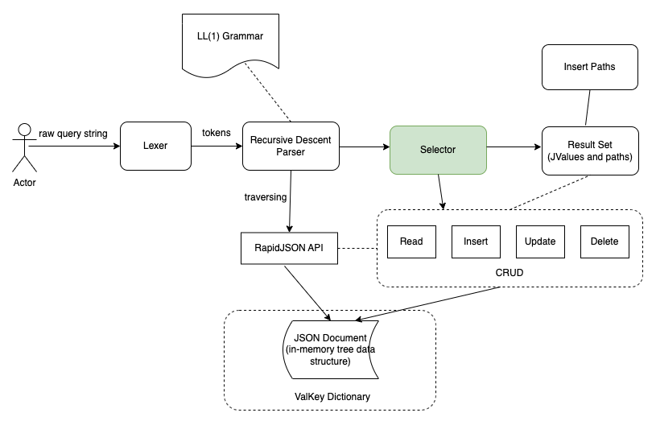
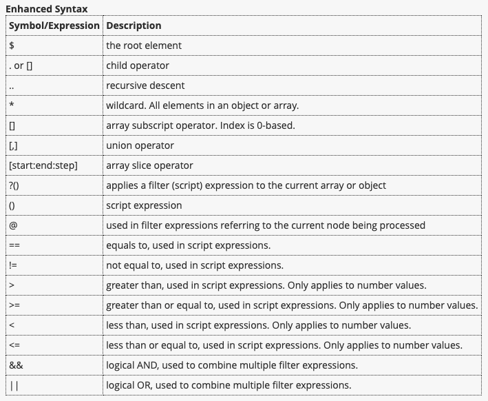
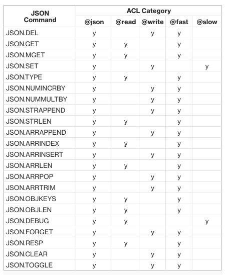
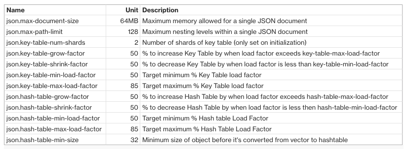
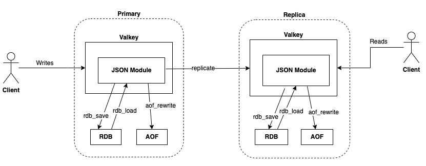

# ValkeyJSON RFC

## Abstract

The proposed Valkey JSON module, named ValkeyJSON, supports the native JavaScript Object Notation (JSON) format to encode 
complex datasets inside Valkey. It is compliant with [RFC7159](http://www.ietf.org/rfc/rfc7159.txt) and [ECMA-404](http://www.ecma-international.org/publications/standards/Ecma-404.htm) 
JSON data interchange standard. With this feature, users can natively store, query, and modify JSON data structures in 
Valkey using the popular [JSONPath query language](https://www.ietf.org/archive/id/draft-goessner-dispatch-jsonpath-00.html). 
To help users migrate from Redis and RedisJSON, and to capitalize on existing RedisJSON client libraries, the module 
is designed to be API-compatible and RDB-compatible with Redis Ltd.’s RedisJSON v2.

## Motivation

JSON format is a widely used data exchange format and simplifies the development of applications that store complex data 
structures by providing powerful searching and filtering capabilities. However, [Valkey core](https://github.com/valkey-io/valkey) 
does not have a native data type for JSON. Redis Ltd.‘s RedisJSON is a popular Redis modules, but not under a true 
open source license and hence cannot be distributed freely with Valkey. There’s a demand in the Valkey 
community to have a JSON module that matches most of the features of RedisJSON and is as API-compatible as possible. 
See the community discussions [here](https://github.com/orgs/valkey-io/discussions?discussions_q=is%3Aopen+JSON).

## Design Considerations

ValkeyJSON will introduce a new JSON data type for Valkey, and commands to insert, update, delete and query JSON data. 
To help users migrate from Redis and RedisJSON, and to capitalize on existing RedisJSON client libraries, ValkeyJSON 
aims to be a drop-in replacement of RedisJSON. Therefore, it is designed be API-compatible and RDB-compatible with 
Redis Ltd.’s RedisJSON.

### RDB Compatibility

To help users migrate from Redis and RedisJSON, ValkeyJSON will support RDB compatibility with RedisJSON. ValkeyJSON can 
load RDBs generated from RedisJSON. Likewise, RedisJSON can load RDBs generated from ValkeyJSON.

### Choice of JSON Library

We have evaluated 7 open source JSON libraries - BSON, ION, MessagePack, yyjson, cJSON, Serde JSON, and RapidJSON. BSON, 
ION and MessagePack do not have write (insert/update/delete) API and therefore cannot be used for the project. Among the 
rest, RapidJSON stands out as both memory efficient and providing efficient insert/update/delete API.

### JSONPath Query Parser

[JSONPath](https://www.ietf.org/archive/id/draft-goessner-dispatch-jsonpath-00.html) is a query language for JSON with 
features similar to XPath for XML. JSONPath is used for selecting and extracting elements from a JSON document. It 
supports advanced query capabilities such as wildcard, filter expressions, slices, union, recursive search, etc.
Using JSONPath query language, users can natively store, query, and modify JSON data structures, either wholly or partially.



One of the deficiencies of the RapidJSON library is that it does not support JSONPath query. RapidJSON only supports 
[JSON Pointer](https://datatracker.ietf.org/doc/html/rfc6901) query language, which is restricted to single-value selection. 
Single-value selection corresponds to the restricted query capability in RedisJSON v1 API. RedisJSON v2 API supports a 
much powerful JSONPath syntax with wildcard, filter expressions, slices, union, recursive search, etc., and can select 
multiple JSON values. RedisJSON v2 API is a superset of v1 API.

We should extend RapidJSON to support a subset of the JSONPath query language that is compatible with RedisJSON v2 API. 
To achieve this, we designed a JSONPath query parser that integrates with RapidJSON. It is a recursive descent parser 
driven by LL(1) grammar. The core class is Selector, which glues everything together, and make the JSONPath query apply 
to all CRUD operations. Internally, the Selector maintains two pointers. One points to the current position in the query 
path string. The other points to the current node in the JSON tree. Based on what’s parsed so far, it takes actions to 
traverse the tree or select target values.

The Selector is designed to work with a vector of values instead of a single value, and compatible with both RedisJSON 
v1 and v2 query syntax. It automatically detects if the query is of v1 or v2 syntax, and sets the member isV2Path. 
Member isWriteMode indicates READ/WRITE mode, which is automatically set based on the entry point method being invoked, 
which is getValues, setValues or deleteValues.

Insert and update is implemented as a 2-phase operation that splits the write operation into two calls - prepareSetValues 
and commit, where prepareSetValues does not change the Valkey data. The purpose of having a 2-phase write is to be able 
to discard the write operation if certain conditions are not satisfied.

### Tokenization of JSON Object Keys

JSON has two container types - Array and Object. The JSON Object is a key/value mapping where keys are restricted to 
be strings, whereas the value can be any valid JSON value, including another container value. Thus, a single JSON document 
can contain multiple JSON objects, each with its own unique namespace. It’s quite common that a key repeatedly appears 
in the same JSON document or across documents. If the number of JSON documents is large, repeated key names can consume 
significant amount of memory usage.

To remove duplicate copies of JSON object key names, the module tokenizes key names by maintaining a global data structure 
called KeyTable, which is a sharded hash table storing key tokens and reference counts. Access to the KeyTable is threadsafe.

## Specification

### Supported JSON Standard

[RFC7159](http://www.ietf.org/rfc/rfc7159.txt) and [ECMA-404](http://www.ecma-international.org/publications/standards/Ecma-404.htm) 
JSON data interchange standard is supported. UTF-8 Unicode in JSON text is supported.

### Root JSON Value

In earlier RFC 4627, only objects or arrays were allowed as root values of JSON. Since [RFC 7159](http://www.ietf.org/rfc/rfc7159.txt), 
the root value of a JSON document can be of any type, scalar type (String, Number, Boolean, Null) or container type (Array, Object). 
ValkeyJSON is compliant with [RFC 7159](http://www.ietf.org/rfc/rfc7159.txt).

### JSON Command API

There are 22 JSON commands. See https://docs.aws.amazon.com/memorydb/latest/devguide/json-list-commands.html. The API is 
compatible with RedisJSON v2. Note that API compatibility here means our command API is a superset of RedisJSON API. 
For example, we have command “JSON.DEBUG DEPTH” and “JSON.DEBUG FIELDS”, while they do not.

### JSONPath Query Syntax

Two kinds of JSONPath query syntaxes are supported:
* Enhanced syntax – Follows the [Goessner-style](https://goessner.net/articles/JsonPath/) JSONPath query syntax, as shown in the table below.
* Restricted syntax – Has limited query capabilities, compatible with RedisJSON v1.

If a query path starts with '$', the enhanced syntax is used. Otherwise, the restricted syntax is used. A query using 
the enhanced syntax always returns an array of values, while a restricted-syntax query always returns a single value. 



For details and examples, see https://docs.aws.amazon.com/memorydb/latest/devguide/json-document-overview.html#json-path-syntax.

### ACL

ValkeyJSON introduces a new ACL category - @json. The category has 22 JSON commands. No existing Valkey commands 
are members of the @json category. 

There are 4 existing ACL categories which are updated to include new JSON commands: @read, @write, @fast, @slow. The 
table below has a column for each of these categories and a row for each command. If the cell contains a “y” then that 
command must be added into that category. All of the other command members of those categories remain unchanged.



### Info metrics

Info metrics are visible through the “info json” or “info modules” command.

| Name                    | 	Description                                                           |
|:------------------------|:---------------------------------------------------------------------|
| json_total_memory_bytes | 	Total amount of memory allocated to JSON documents and meta data. |
| json_num_documents	  | Number of JSON keys                                                   | 

### Configs



### Document Size Limit

JSON documents are stored internally in a format optimized for rapid access and modification. This format typically 
results in consuming somewhat more memory than the equivalent serialized representation of the same document does. 
The consumption of memory by a single JSON document is limited to 64MB by default, which is the size of the in-memory 
data structure, not the serialized JSON string. The value can be overridden by module config json.max-document-size.

The amount of memory consumed by a JSON document can be inspected by 
using the “JSON.DEBUG MEMORY" or “MEMORY USAGE” command. “JSON.DEBUG MEMORY <key> [<path>]" can also report the size 
of a JSON sub-tree.

### Nesting Depth Limit

When a JSON object or array has an element that is itself another JSON object or array, that inner object or array is 
said to “nest” within the outer object or array. To avoid stack overflow, it's good to have a limit on the nesting depth.
The default path limit is 128 levels. Any attempt to create a document that contains a nesting depth greater than 128 
will be rejected with an error message. The value can be overridden by module config json.max-path-limit.

### Module API

ValkeyJSON integrates with Valkey core by implementing Valkey module API.



#### Module OnLoad

Upon loading, the module registers a new JSON data type. All operations such as query, insert, update and delete are 
efficiently performed on the in-memory document objects, as opposed to JSON text.

* Module name: json
* JSON data type name: ReJSON-RL (Note: We use the same name as the one in RedisJSON for the sake of RDB compatibility.)

#### Persistence

ValkeyJSON hooks into Valkey’s persistence API via the module type callbacks:

* rdb_save: Serializes document objects to RDB. Serialized JSON string is saved in RDB.
* rdb_load: Deserializes document objects from RDB.
* aof_rewrite: Emits commands into the AOF during the AOF rewriting process.

#### Memory Management

The JSON data type also supports memory management related callbacks:

* free: Deallocates a key when it is deleted, expired or evicted.
* defrag: Supports active defrag for JSON keys
* mem_usage: Reports JSON document size (AKA “memory usage” command)
* copy: Supports copy of JSON key

#### Keyspace Event Notification

Every JSON write command publishes a keyspace event after the data is mutated.
* Event type: REDISMODULE_NOTIFY_GENERIC
* Event name: command name in lowercase. e.g., json.set command publishes event "json.set".

Users can subscribe to the JSON events via the standard keyspace event pub/sub. For example,

```text
1. enable keyspace event notifications:
    valkey-cli config set notify-keyspace-events KEA
2. suscribe to keyspace & keyevent event channels:
    valkey-cli psubscribe '__key*__:*'
```

#### Replication

Every JSON write command is replicated to replicas by calling ValkeyModule_ReplicateVerbatim.

## References

* [JSON Command API](https://docs.aws.amazon.com/memorydb/latest/devguide/json-list-commands.html)
* [JSONPath query syntax](https://docs.aws.amazon.com/memorydb/latest/devguide/json-document-overview.html#json-path-syntax)
* JSON blog: [Unlocking JSON workloads with ElastiCache and MemoryDB](https://aws.amazon.com/blogs/database/unlocking-json-workloads-with-elasticache-and-memorydb)
